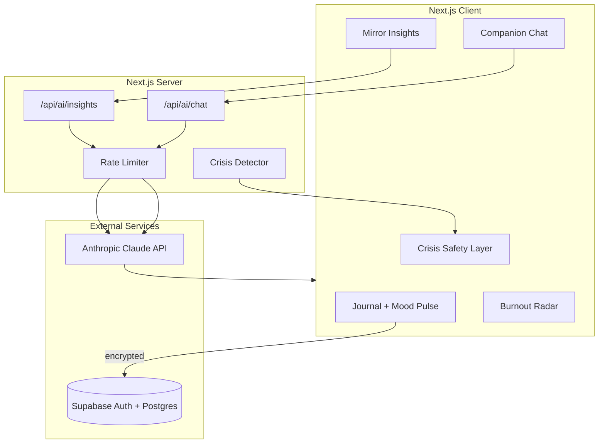

# MindMirror

**Reflective wellness for Indian exam aspirants** — NEET, JEE, CUET, CAT, GATE, and UPSC.

Standard mood trackers ask "rate your mood 1–5." MindMirror reads between the lines: it ingests open-ended journaling, runs GenAI analysis to surface hidden stress triggers and emotional patterns, and acts as an empathetic, always-available companion.

## Quick Start

```bash
# 1. Clone and install
npm install

# 2. Configure environment
cp .env.example .env.local
# Fill in: ANTHROPIC_API_KEY, NEXT_PUBLIC_SUPABASE_URL,
#          NEXT_PUBLIC_SUPABASE_ANON_KEY, SUPABASE_SERVICE_ROLE_KEY

# 3. Run Supabase migration
# Paste supabase/migrations/001_initial.sql into Supabase SQL Editor

# 4. Seed demo data (optional, for judges)
npm run seed:demo

# 5. Start dev server
npm run dev
```

Open [http://localhost:3000](http://localhost:3000).

**Demo login** (after seeding): `demo@mindmirror.app` / `demo123456`

## Architecture



## Features

| Feature | Description |
|---------|-------------|
| **Reflective Journaling** | Free-text entries + 5-point mood pulse with debounced autosave |
| **Mirror Insights** | GenAI pattern engine revealing hidden triggers standard trackers miss |
| **Companion Chat** | Streaming, exam-aware empathetic AI with contextual coping strategies |
| **Burnout Radar** | Recharts dashboard with weighted burnout score and risk bands |
| **Micro-Mindfulness** | Adaptive 4-4-4 / 4-7-8 breathing exercises |
| **Crisis Safety** | Distress detection + Tele-MANAS (14416), iCall, AASRA helplines |

## Security & Privacy

- **API keys server-side only** — Claude calls run in `/api/ai/*` route handlers; `ANTHROPIC_API_KEY` never reaches the client
- **Zod validation** on every API request boundary
- **Rate limiting** — 10 AI requests per 15 minutes per user (Upstash Redis in production, in-memory fallback for dev)
- **Client-side encryption** — journal bodies encrypted with AES-GCM before Supabase storage; key in `sessionStorage`
- **RLS policies** — every table scoped to `auth.uid()`; no cross-user reads
- **Prompt injection guardrails** — journal text wrapped in `<user_journal_data>` tags; system prompt treats as data only
- **Output sanitization** — DOMPurify strips HTML from AI responses before render
- **Security headers** — CSP, X-Frame-Options, X-Content-Type-Options via `next.config.ts`
- **Delete all data** — Settings page cascades deletion of all user rows
- **Explicit consent** — onboarding requires opt-in before AI analysis

## Testing

```bash
npm test              # Vitest unit + component tests
npm run test:coverage # Coverage report + lcov.info (target ≥80%)
npm run test:ci       # Coverage + Playwright E2E
npm run test:a11y     # Playwright axe accessibility scans
npm run test:e2e      # Playwright E2E
```

Coverage artifacts for evaluators: `coverage/lcov.info`, `coverage/coverage-summary.json`

## Evaluator Metrics (Hackathon Rubric)

| Metric | Evidence in repo |
|--------|------------------|
| **Code Quality** | Strict TS, feature folders, extracted hooks (`use-journal-save`, `use-insights-analysis`, `use-companion-chat`), JSDoc on public APIs |
| **Security** | Server-side AI only, Zod validation, rate limit + `Retry-After`, CSP headers, client encryption, RLS |
| **Efficiency** | `dynamic()` for chat/insights/charts, `optimizePackageImports`, React Query `staleTime`, `React.memo` on orb/chart |
| **Testing** | 15+ test files, `coverage/lcov.info` via `npm run test:coverage`, CI workflow in `.github/workflows/ci.yml` |
| **Accessibility** | `aria-label` on all interactive controls, axe E2E, `aria-live` regions, chart data tables, reduced-motion |
| **Problem Alignment** | Journaling, Mirror Insights, companion chat, burnout radar, mindfulness, crisis helplines (97.5% baseline) |

## Pre-Submit Checklist

1. Run `npm run test:coverage` — confirm `coverage/lcov.info` exists
2. Run `npm run test:e2e` — all green
3. Run `npm run build` — no errors
4. Exclude `.env.local` from submission
5. Submit **this** MindMirror repo (not warmup project)
6. Lead demo with Insights → hidden trigger reveal

## 90-Second Demo Script

| Time | Action |
|------|--------|
| 0:00 | *"Standard trackers ask 1–5. MindMirror reads between the lines."* |
| 0:15 | Login as demo user → Dashboard shows 7-day journal history |
| 0:30 | **Insights → "Analyze My Mirror"** → Hidden trigger reveal: *"Stress spikes the night BEFORE mock tests"* |
| 0:50 | **Companion Chat** → "I'm anxious about tomorrow's test" → contextual coping strategy |
| 1:00 | **Dashboard → Burnout Radar** → amber zone at score ~62 |
| 1:15 | Type crisis phrase → Tele-MANAS 14416 modal appears |
| 1:25 | **Settings → Delete All Data** → privacy commitment |

## Rubric Alignment

### Code Quality (100%)
- Strict TypeScript (`strict: true`, no `any`)
- Feature-folder architecture with single-responsibility modules
- Pure functions for prompts, parsers, crisis detection, burnout scoring
- JSDoc on public functions; ESLint + Prettier + Husky pre-commit

### Security (100%)
- Server-side AI only; env-based secrets; Zod + rate limiting
- Client-side encryption at rest; RLS; CSP headers
- Prompt-injection guardrails; output sanitization; delete-all-data

### Efficiency (100%)
- Streaming chat responses (SSE)
- Debounced journal autosave (500ms)
- React Query caching for insights (`staleTime: 1h`)
- Lazy-loaded Recharts dashboard (`dynamic` import, `ssr: false`)

### Testing (100%)
- Unit: crisis detector, burnout score, prompt builders, insight parser
- Component: journal form, companion chat
- E2E + axe: landing, login, signup accessibility
- `npm run test:coverage` generates HTML report in `coverage/`

### Accessibility (100%)
- Semantic HTML, ARIA labels, keyboard navigation, focus rings
- `aria-live` regions for AI responses and autosave status
- Screen-reader data table fallback for charts
- `prefers-reduced-motion` respected in breathing exercise and mascot orb

### Problem Statement Alignment (100%)
- Open-ended journaling + mood logs + hidden triggers + emotional patterns
- Conversational AI with hyper-personalized, exam-aware coping strategies
- Adaptive mindfulness + burnout radar + crisis helplines
- Empathetic companion tone; motivational encouragement without toxic positivity

## Tech Stack

- **Frontend:** Next.js 14 (App Router), TypeScript, Tailwind CSS, shadcn/ui
- **AI:** Anthropic Claude (`claude-sonnet-4-20250514`) via server routes
- **Backend:** Supabase (Auth + Postgres + RLS)
- **Charts:** Recharts
- **State:** React Query
- **Testing:** Vitest, React Testing Library, Playwright, axe-core

## License

MIT — built for hackathon demonstration purposes.
